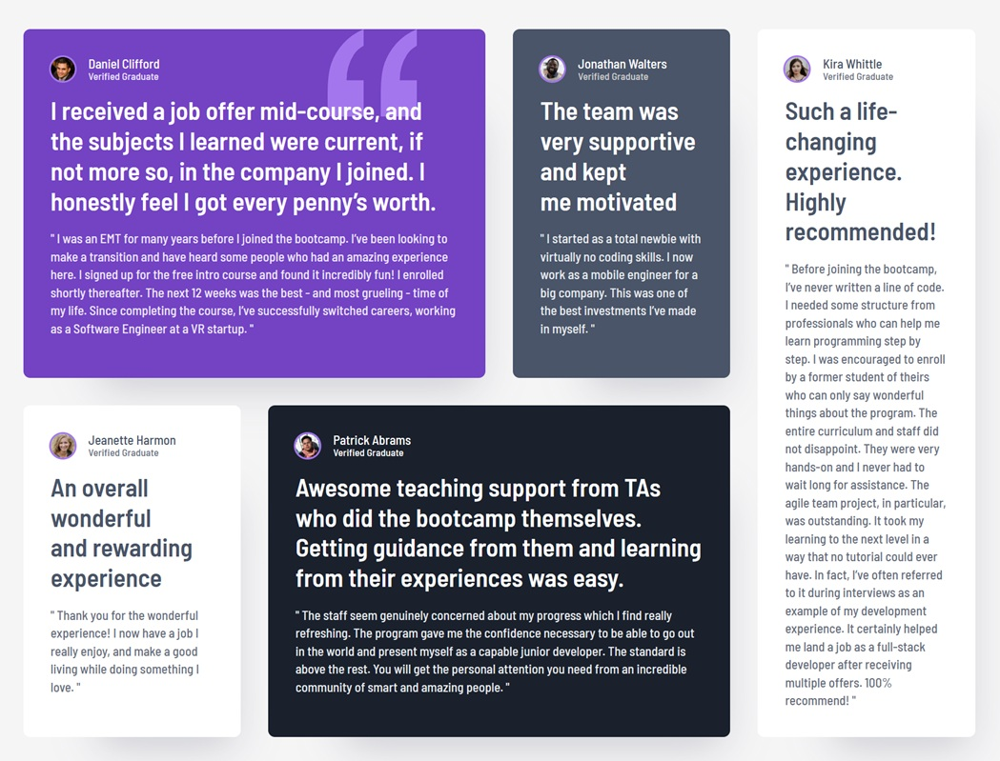

# Frontend Mentor - Testimonials grid section solution

This is a solution to the [Testimonials grid section challenge on Frontend Mentor](https://www.frontendmentor.io/challenges/testimonials-grid-section-Nnw6J7Un7). Frontend Mentor challenges help you improve your coding skills by building realistic projects.

## Table of contents

- [Overview](#overview)
  - [The challenge](#the-challenge)
  - [Screenshot](#screenshot)
  - [Links](#links)
- [My process](#my-process)
  - [Built with](#built-with)
  - [What I learned](#what-i-learned)
  - [Continued development](#continued-development)
  - [Useful resources](#useful-resources)

## Overview

### The challenge

Users should be able to:

- View the optimal layout for the site depending on their device's screen size

### Screenshot



### Links

- Solution URL: [Repository URL](https://github.com/vCentDev/testimonials-grid-section)
- Live Site URL: [Live URL](https://your-live-site-url.com)

## My process

### Built with

- Semantic HTML5 markup
- CSS custom properties
- Flexbox
- CSS Grid
- Mobile-first workflow
- BEM CSS

### What I learned

- In this challenge, there wasn't a title, but it is still important to include one. To adhere to standards and accommodate users who rely on screen readers, I added a title and used the class `.sr-only` to hide it, ensuring it doesn't disrupt the overall design.

```html
<h1 class="sr-only">Testimonials from Our Clients</h1>
```

```css
.sr-only {
  position: absolute;
  width: 1px;
  height: 1px;
  padding: 0;
  margin: -1px;
  overflow: hidden;
  clip-path: inset(50%);
  white-space: nowrap;
}
```

- I have enhanced my CSS grid skills by utilizing it to arrange HTML elements for mobile, tablet, and desktop designs.

- Creating a professional responsive CSS design is crucial, as is adapting the font size based on the device being used. To achieve that, I used the clamp()function.

```css
font-size: clamp(0.8125rem, 0.769rem + 0.2174vw, 0.9375rem);
```

### Continued development

- To continue improving my CSS skills, I will focus on CSS grid features, as they are essential for achieving good layouts. I also want to improve my correct use of the BEM methodology and explore Cube CSS.

### Useful resources

- [Utopia](https://utopia.fyi/) - This helped me to understand an fluid responsive design.
- [Guide to CSS Grid](https://www.joshwcomeau.com/css/interactive-guide-to-grid/) - This is an amazing article which helped me to understand Grid system concept.
